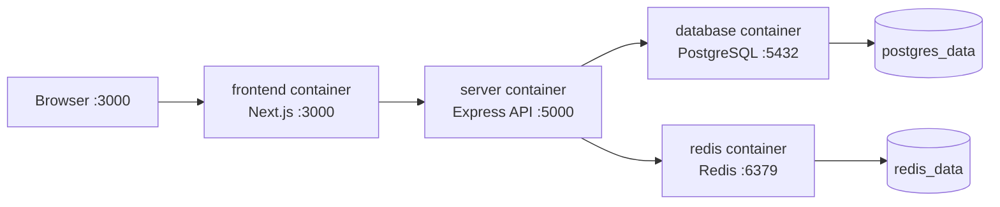

# Docker Architecture

## Overview

The complete application has four runtime services:



The browser uses published host ports. Containers use Compose's private default network and service-name DNS.

## Directory Layout

```text
src/client/Dockerfile                 frontend-only image
src/server/Dockerfile                 server-only image
src/database/Dockerfile               PostgreSQL image wrapper
docker/combined/Dockerfile             frontend and server targets
docker/combined/docker-compose.yml     complete application
docker/combined/.env.example           local configuration template
src/client/.dockerignore               small frontend build context
src/server/.dockerignore               small server build context
docs/*-dockerization.md                component guides
```

## Combined Dockerfile

File: `docker/combined/Dockerfile`

```dockerfile
FROM node:22-alpine AS frontend
```

Creates the named `frontend` build target.

```dockerfile
WORKDIR /app
COPY src/client/package*.json ./
RUN npm ci
COPY src/client ./
```

Creates the working directory, caches dependency installation, and copies frontend source.

```dockerfile
ARG NEXT_PUBLIC_API_URL_PROD=...
ARG NEXT_PUBLIC_SOCKET_URL=...
ENV ...
```

Provides browser API URLs during the Next.js build.

```dockerfile
RUN sed -i ... && npm run build
```

Uses an image-only font fallback to avoid a Google Fonts network dependency, then builds Next.js.

```dockerfile
EXPOSE 3000
CMD ["npm", "start"]
```

Documents the frontend port and starts Next.js.

```dockerfile
FROM node:22-alpine AS server
```

Creates an independent `server` target. Compose chooses either target; it does not run both from one container.

```dockerfile
WORKDIR /app
COPY src/server/package*.json ./
RUN npm ci
COPY src/server/prisma ./prisma
RUN npx prisma generate
COPY src/server ./
RUN npm run build
```

Installs server dependencies, generates Prisma, copies server files, and compiles TypeScript.

```dockerfile
ENV NODE_ENV=production
ENV PORT=5000
EXPOSE 5000
CMD ["npm", "start"]
```

Configures and starts the compiled API server.

## Compose Architecture

File: `docker/combined/docker-compose.yml`

### Frontend

`build.context: ../..` gives Docker the repository root. `target: frontend` selects the frontend target. The `args` are embedded into the browser bundle. `3000:3000` maps host port 3000 to the container. The health-gated dependency waits for the backend before starting the frontend.

### Server

`target: server` selects the server image. Its command first applies Prisma migrations and then starts the API. `env_file: .env` loads local secrets. Compose then overrides the internal database and Redis URLs so they always point to the Compose services.

The server publishes `5000:5000`. Its health check calls `/live`; the frontend waits for this check to pass.

### Database

The database is built from `src/database/Dockerfile`. Compose passes PostgreSQL initialization variables and mounts `postgres_data` at PostgreSQL's data directory. `pg_isready` confirms that PostgreSQL accepts connections.

### Redis

Redis uses the official `redis:7-alpine` image. It is private because only the server needs it. `redis_data` persists Redis data and `redis-cli ping` is its health check.

### Volumes

```yaml
volumes:
  postgres_data:
  redis_data:
```

Named volumes survive container recreation. `docker compose down` preserves them. `docker compose down -v` deletes them.

## Startup Sequence

1. Compose reads `.env` and builds images.
2. PostgreSQL and Redis start.
3. Compose waits for both health checks.
4. The server starts and applies migrations.
5. The server connects to PostgreSQL and Redis.
6. `/live` becomes healthy on port `5000`.
7. The frontend starts on port `3000`.
8. The browser calls the API at `http://localhost:5000`.
9. The server reads products and other records from PostgreSQL.

## Fresh Reproduction

```bash
cd docker/combined
cp .env.example .env
docker compose up --build -d
docker compose ps
docker compose exec server npm run seed
```

Open `http://localhost:3000`.

## Data Flow Verification

```bash
curl http://localhost:5000/live
curl -X POST http://localhost:5000/api/v1/graphql \
  -H "content-type: application/json" \
  --data '{"query":"{ products(first: 3) { totalCount products { name slug } } }"}'
```

Migrations alone can produce zero products. Run `npm run seed` to insert the sample catalog.

## Troubleshooting

### Frontend refuses connection

```bash
docker compose ps
docker compose logs frontend server
```

The frontend stays `Created` until the server is healthy.

### Demo or stale products appear

The client intentionally falls back to bundled demo products when its GraphQL request fails. Check `/live`, inspect server logs, and seed the database.

```bash
docker compose exec server npm run seed
```

### Reset everything

```bash
docker compose down -v
docker compose up --build -d
docker compose exec server npm run seed
```

### Remove unrelated old containers

```bash
docker compose down --remove-orphans
docker compose up --build -d
```

## Useful Commands

```bash
docker compose ps
docker compose logs -f server
docker compose logs -f frontend
docker compose exec server npm run seed
docker compose down
docker compose down -v
```